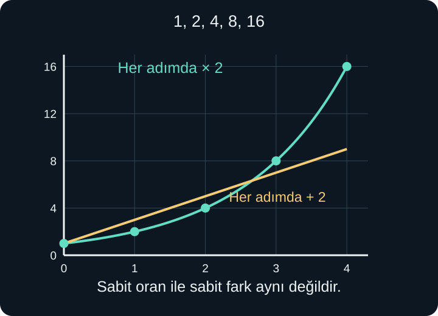
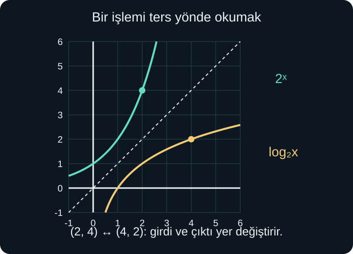

import ArticleVideo from '@/components/ArticleVideo.astro'
import kavram from './media/01-kavram.mp4?url'
import kavramPoster from './media/01-kavram.jpg?url'

Bir başlangıç miktarını her adımda iki katına çıkaralım. İlk miktar 1 ise değerler 1, 2, 4, 8, 16 diye ilerler. Başka bir süreçte aynı başlangıca her adımda 2 ekleyelim: 1, 3, 5, 7, 9 elde ederiz. İlk süreçte sabit kalan oran, ikincisinde sabit kalan farktır.

Beşinci veya yirminci adımdaki miktarı bulmak istediğimizde ilk süreç üslerle ifade edilir. Soruyu ters çevirip “hangi adımda 16'ya ulaşırız?” dediğimizde ise üssü ararız. **Logaritma**, bu ters soruyu bir fonksiyon olarak ifade eder.

[Önceki yazıda](/blog/fonksiyonlarda-bileske-ters-ve-donusum/) ters fonksiyonun koşullarını öğrendik. Burada üs ve kök kuralları, oran ve yüzde, fonksiyon grafikleri ve denklem çözme bilgilerine dayanacağız. Üslü ifadelerde tabanın, logaritmada hem tabanın hem girdinin koşullarını açık tutacağız. Gerçek sayı üslerinin ayrıntılı kuruluşunda gereken limit fikrini henüz ispatlanmış saymayacağız.

## 1. Sabit Fark Yerine Sabit Oran

İkiye katlanan miktarı $n$ adım sonra $P(n)$ ile gösterelim. Başlangıcı $n=0$ olarak sayarız. Henüz hiç ikiye katlama yapmadığımız için $P(0)=1$ olur. Sonraki değerler:

$$
P(1)=2,\quad P(2)=2\times2=4
$$

$$
P(3)=2\times2\times2=8
$$

şeklinde kurulur. Genel kural $P(n)=2^n$ olur. $n$ şimdilik negatif olmayan tam sayı adım sayısıdır. Başlangıcı 5 seçseydik aynı adımlarda $5,10,20,40$ elde eder, $P(n)=5\times2^n$ yazardık.

Her adımda 2 eklenen kural ise $L(n)=1+2n$ olur. $n=4$ için $P(4)=16$, $L(4)=9$ elde edilir. Biri her defasında aynı miktarda, diğeri o sıradaki miktarın kendisi kadar artmaktadır. Artış miktarları 1, 2, 4, 8 diye büyüse de ardışık çıktıların oranı hep 2'dir.

“Üstel” sözcüğü yalnızca çok hızlı artış demek değildir. Belirli eşit girdi artışlarında çıktının aynı çarpanla değiştiğini anlatır. Çarpan 1'e yakınsa üstel büyüme başlangıçta yavaş görünebilir. Çarpan 0 ile 1 arasındaysa aynı yapı büyüme yerine azalma üretir.

<ArticleVideo src={kavram} poster={kavramPoster} title="Her adımda ikiye katlanmak" caption="Adım sayısı bir artarken miktar ikiyle çarpılır. n=0,1,2,3,4 için değerler 1,2,4,8,16 olur." />

## 2. Üstel Fonksiyonun Taban Koşulları

Temel üstel fonksiyonu:

$$
f(x)=a^x,\qquad a>0,\quad a\ne1
$$

diye tanımlarız. $a$ sabit **taban**, $x$ değişen üstür. $x^2$ ile $2^x$ aynı tür kural değildir. İlkinde taban değişir ve üs sabittir; ikincisinde taban sabit, üs değişkendir.

Tabanın pozitif olmasını isteriz; çünkü bütün gerçek $x$ girdilerini kullanacağız. Negatif tabanda örneğin $(-2)^{1/2}$ gerçek sayı değildir. Sıfır taban negatif üslerde $1/0$ sorununa yol açar. Taban 1 olursa $1^x=1$ sabit fonksiyonu elde edilir; farklı girdileri ayıramadığı için birazdan kuracağımız ters fonksiyona uygun değildir.

$a>1$ ise fonksiyon artan, $0<a<1$ ise azalandır. Her iki durumda da çıktılar pozitiftir. Tanım kümesi bütün gerçek sayılar, görüntü kümesi $(0,\infty)$ olur. $a^0=1$ olduğundan grafik $(0,1)$ noktasından geçer.

Başlangıç miktarı içeren $P(x)=C a^x$ modelinde $C$ sabit çarpandır. Pozitif bir miktarı temsil ederken $C>0$ seçeriz. Böylece $P(0)=C$ olur. Negatif $C$ matematiksel olarak mümkün olsa da grafik ve işaret yorumunu değiştirir; pozitif miktar örneklerimizde onu kullanmayacağız.

## 3. Tam Sayıdan Kesirli ve Gerçek Üsse

$2^{-1}=1/2$, $2^{-2}=1/4$ değerlerini üs kurallarından biliyoruz. Geriye doğru bir adım, ikiye bölmektir. Kesirli üsteyse pozitif kök tanımı devreye girer. $2^{1/2}$, karesi 2 olan pozitif sayıdır: $\sqrt2$.

Üssü iki yarım adım artırdığımızda toplam bir adım ilerlemiş olmalıyız. Bu nedenle yarım adımın çarpanı kendisiyle çarpılınca 2 vermelidir. $\sqrt2\times\sqrt2=2$ eşitliği, kesirli üssün sabit oran fikriyle uyumunu gösterir.

Pozitif taban ve tam sayılar $p$, $q$ için, $q>0$ olmak üzere:

$$
a^{p/q}=\sqrt[q]{a^p}
$$

yazabiliriz. Örneğin $8^{2/3}=(\sqrt[3]8)^2=4$ olur. Negatif pay, ilgili pozitif kuvvetin tersini alır: $4^{-1/2}=1/2$.

Peki $2^{\sqrt2}$ ne demektir? Üs artık bir kesirle tam yazılamaz. $\sqrt2$'yi 1,4; 1,41; 1,414 gibi giderek daha iyi rasyonel yaklaşımlarla çevreleyip ilgili kuvvetlerin yaklaştığı değeri kullanırız. Burada “irrasyonel sayıda çarpanı yan yana yazmak” gibi bir işlem yapmıyoruz; üslü gösterimi tutarlı bir yaklaşım süreciyle genişletiyoruz.

Bu genişletmenin varlık ve tekliğinin tam ispatı, gerçek sayıların ve limitlerin özelliklerini gerektirir. Şimdilik kullanılan yapıyı açıkça belirtiyoruz: pozitif taban için gerçek üslerde üs kuralları korunur ve grafik kopmadan devam eder. Hesap makinesindeki ondalık değer, bu tanımlanmış sayının yaklaşık gösterimidir.

## 4. Yüzde Artış ve Azalışı Çarpana Çevirmek

Bir miktar her adımda yüzde 8 artsın. Yeni miktar, eskisinin tamamı ile yüzde 8'inin toplamıdır. Bu nedenle çarpan $1+0{,}08=1{,}08$ olur. Başlangıç miktarı 100 birimse:

$$
P(n)=100(1{,}08)^n
$$

İlk adımda 108, ikinci adımda $108\times1{,}08=116{,}64$ birim elde edilir. Her adımda 8 birim eklenmez; ikinci artış 108'in yüzde 8'i olan 8,64 birimdir. Beş adım sonra yaklaşık 146,93 birim bulunur.

Yüzde 20 azalma için çarpan $1-0{,}20=0{,}80$ olur. Başlangıç 100 ise iki adım sonra $100(0{,}8)^2=64$ kalır. Toplam azalma yüzde 40 değil, yüzde 36'dır. Her adımın yüzdesi o sırada kalan miktardan hesaplanır.

Bu modellerin sabit oran varsayımına dayandığını unutmayalım. Gerçek bir süreçte kapasite, kaynak veya ölçüm koşulları değişebilir. Birkaç adımın benzer görünmesi, aynı çarpanın sınırsız süre geçerli olacağını kanıtlamaz. Modelin hangi aralıkta kullanılacağı ayrıca belirtilmelidir.

## 5. Zaman Birimi Üssün İçinde

Bir miktar üç saatte bir iki katına çıkıyorsa, saati doğrudan üs olarak yazmak yanlış olur. $t$ geçen saatin sayısı olsun. Tamamlanan üç saatlik dönem sayısı $t/3$ olduğundan:

$$
P(t)=P_0\,2^{t/3}
$$

Burada $P_0$ başlangıç miktarıdır. Üçüncü saatte üs 1, altıncı saatte üs 2 olur. Başlangıç 80 ise bu zamanlarda 160 ve 320 bulunur. Bir buçuk saatte sürekli üstel modeli kabul edersek üs $1/2$, miktar $80\sqrt2$ olur.

Süreyi dakikaya çevirirsek dönem 180 dakikadır ve $P(s)=P_0,2^{s/180}$ yazarız; $s$ dakika sayısını gösterir. Fiziksel olarak üs, sürelerin oranıdır ve birimsizdir. Sayısal formülde zaman birimini değiştirirken paydadaki dönem de değiştirilir.

Her üç saatte bir yapılan ayrı bir işlemle, aralarda kesintisiz büyüyen süreç aynı model değildir. İlkinde miktar adımlar arasında sabit kalabilir; ikincisinde kesirli zamanlara da üstel kural uygulanır. Hangi yorumun kullanıldığını söylemek, grafiği çizgilerle doldurmadan önce gerekir.

## 6. Logaritma Üssü Soruyor

$2^3=8$ eşitliğinde taban 2, üs 3, sonuç 8'dir. Sonucu ve tabanı bilip üssü aradığımızda:

$$
\log_2 8=3
$$

yazarız. “İki tabanında sekizin logaritması üçtür” diye okunur. Anlamı, “2'yi hangi üsse yükseltirsek 8 elde ederiz?” sorusudur.

Genel tanım:

$$
\log_a x=y\quad\Longleftrightarrow\quad a^y=x
$$

Çift yönlü ok, iki ifadenin aynı ilişkiyi anlattığını belirtir. Koşullar $a>0$, $a\ne1$ ve $x>0$'dır. Pozitif tabanlı üstel fonksiyon yalnızca pozitif çıktılar ürettiği için gerçek logaritmanın girdisi pozitif olmalıdır.

Örneğin $\log_3 81=4$, çünkü $3^4=81$. $\log_2(1/8)=-3$, çünkü $2^{-3}=1/8$. Logaritmanın çıktısı negatif olabilir; yasak olan negatif **girdi**dir. $\log_a1=0$ ve $\log_a a=1$ ilişkileri, sırasıyla $a^0=1$ ve $a^1=a$ eşitliklerinden gelir.

## 7. Üstel ve Logaritmik Grafiklerin Bağı

$a^x$ fonksiyonu birebirdir; taban 1'den büyükse sürekli artar, 0 ile 1 arasındaysa sürekli azalır. Bu nedenle her pozitif çıktıdan tek bir gerçek girdiye dönebiliriz. Logaritma bu ters fonksiyondur.

$2^2=4$ olduğundan üstel grafikte $(2,4)$ noktası vardır. $\log_2 4=2$ olduğundan logaritma grafiğinde $(4,2)$ bulunur. Girdiyle çıktının yer değiştirmesi bütün noktalarda geçerlidir.

Terslik iki bağıntıyla kontrol edilir:

$$
\log_a(a^x)=x\qquad(x\in\mathbb R)
$$

$$
a^{\log_a x}=x\qquad(x>0)
$$

$\mathbb R$, gerçek sayılar kümesini gösterir. Birinci bağıntıda üstel sonuç zaten pozitiftir; ikinci bağıntıda ise başlangıçtaki logaritmanın tanımlı olması için $x>0$ gerekir.

$a>1$ durumunda $a^x$ grafiği sola giderken sıfıra yaklaşır ama sıfır olmaz. Logaritma grafiği de girdi pozitif taraftan sıfıra yaklaşırken aşağı doğru sınırsız iner; sıfırda tanımlanmaz. Yaklaşılan eksene **asimptot** denir. Burada limit sembollerini henüz kullanmadan, grafiğin bir değere yaklaşmasıyla o değeri almasını ayırıyoruz.

## 8. Logaritma Kuralları Üslerden Gelir

Aynı geçerli $a$ tabanında $\log_a u=p$, $\log_a v=q$ olsun; $u$ ve $v$ pozitiftir. Tanımdan $u=a^p$, $v=a^q$ elde edilir. Çarpımlarını alırsak:

$$
uv=a^pa^q=a^{p+q}
$$

olur. Bu eşitliğin logaritmik okuması:

$$
\log_a(uv)=\log_a u+\log_a v
$$

şeklindedir. Çarpımın logaritmasında toplama yapmamızın nedeni, kuvvetlerin çarpımında üslerin toplanmasıdır. Aynı gerekçeyle bölümde üsler çıkarılır:

$$
\log_a\left(\frac uv\right)=\log_a u-\log_a v
$$

$u>0$ ve gerçek $r$ için kuvvet kuralı da $\log_a(u^r)=r\log_a u$ olur. Örneğin $\log_2(8^2)=2\log_2 8=6$ buluruz; $8^2=64$ ve $2^6=64$ doğrular.

Bu kurallar koşullarıyla kullanılır. $\log_a(x^2)=2\log_a x$ yazımı $x>0$ için geçerlidir. $x<0$ iken sol taraf tanımlı olabilir, sağdaki $\log_a x$ değildir. $x\ne0$ için uygun genel yazım $\log_a(x^2)=2\log_a|x|$ olur.

Logaritma toplama üzerine dağılmaz. $\log_2(1+1)=1$ iken $\log_2 1+\log_2 1=0$ olur. İçerideki işlemin çarpım mı toplam mı olduğunu görmek, kuralı seçmenin ilk adımıdır.

## 9. Başka Bir Tabanda Hesaplamak

Hesap makinesinde istediğimiz taban bulunmayabilir. $y=\log_a x$ dersek $a^y=x$ olur. Her iki tarafın başka bir geçerli $b$ tabanında logaritmasını alalım:

$$
y\log_b a=\log_b x
$$

$a\ne1$ olduğu için $\log_b a\ne0$'dır; buna bölebiliriz:

$$
\log_a x=\frac{\log_b x}{\log_b a}
$$

Bu, **taban değiştirme formülüdür**. Kullanılan $a$ ve $b$ tabanları pozitif ve 1'den farklı, $x$ pozitiftir. Pay ile paydada aynı yeni tabanı kullanırız.

Örneğin $3^x=7$ denkleminin çözümü $x=\log_3 7$'dir. Ondalık yaklaşık değer için taban değiştirerek yaklaşık $1{,}77124$ buluruz. Tam cevap $\log_3 7$ olarak kalabilir; ondalık yazım işlem kolaylığı sağlar ama tam değerin yerine eşitlik işaretiyle konmamalıdır.

## 10. Doğal Taban e ve Doğal Logaritma

Matematikte yaklaşık $2{,}71828$ olan özel bir pozitif sayı **$e$** ile gösterilir. Bu sayıyla tanışmanın bir yolu $(1+1/n)^n$ değerlerine bakmaktır. $n$ pozitif tam sayıdır. $n=1$ için 2, $n=2$ için 2,25, $n=10$ için yaklaşık 2,59374, $n=100$ için yaklaşık 2,70481 elde edilir.

$n$ büyüdükçe bu değerler belirli bir sayıya yaklaşır; o sayı $e$'dir. Bu ifade, aynı toplam oran fikrini daha çok küçük çarpanla uyguladığımızda ne olduğunu incelememizi sağlar. Yaklaşmanın tam tanımı ve ispatı limit bölümüne aittir; burada $e$'nin bir değişken değil, belirli bir sabit olduğunu bilmemiz yeterlidir.

$e$ tabanındaki logaritma **doğal logaritma** diye adlandırılır ve $\ln x$ ile yazılır. Dolayısıyla $\ln x=\log_e x$ olur. $\ln e=1$, $\ln1=0$ ve $e^{\ln x}=x$ bağıntıları $x>0$ koşulunda geçerlidir. Bazı bağlamlarda tabanı yazılmayan $\log$ onluk, bazılarında doğal logaritma anlamına gelir; belirsizlik varsa tabanı açık yazarız.

Doğal tabanın değişim problemlerinde neden özellikle kullanışlı olduğunu türev konusu açıklayacak. Şimdilik diğer geçerli tabanlarla aynı logaritma kurallarını sağladığını kullanabiliriz. Örneğin $\log_3 7=\ln7/\ln3$ olur.

## 11. Üstel ve Logaritmik Denklem Çözmek

$2^{x+1}=16$ denkleminde sağ tarafı $2^4$ yazabiliriz. Aynı tabanlı üstel fonksiyon birebir olduğundan $x+1=4$, dolayısıyla $x=3$ bulunur. Yerine koyunca $2^4=16$ doğrulanır.

$100(1{,}08)^t=200$ örneğinde önce 100'e böleriz: $(1{,}08)^t=2$. Doğal logaritma alınca $t\ln(1{,}08)=\ln2$ olur. Böylece:

$$
t=\frac{\ln2}{\ln(1{,}08)}\approx9{,}006
$$

bulunur. Bu, sürekli üstel modelin iki katına ulaşma zamanıdır. Eğer model yalnızca tam sayı adımlarında değerlendirilirse 9'uncu adım biraz yetersiz, 10'uncu adım yeterlidir. Çözümün sayısal türünü modelin tanım kümesi belirler.

Logaritmik denklemde koşulu başta yazalım:

$$
\ln(x-1)+\ln(x+1)=\ln8
$$

İki logaritma için $x-1>0$ ve $x+1>0$, birlikte $x>1$ gerekir. Çarpım kuralıyla $\ln((x-1)(x+1))=\ln8$ elde edilir. Logaritma birebir olduğu için $x^2-1=8$, yani $x^2=9$ olur. Cebirsel adaylar 3 ve $-3$'tür, fakat koşulu yalnızca 3 sağlar. Başlangıçta yasak olan $-3$'ü çözüm olarak tutamayız.

## 12. Azalan Tabanla Eşitsizlik

$(1/2)^x$ fonksiyonu azalandır. Dolayısıyla $x$ büyüdükçe çıktı küçülür. $(1/2)^x<1/8$ eşitsizliğinde $1/8=(1/2)^3$ yazılır. Çıktının daha küçük olması için girdinin daha büyük olması gerekir: $x>3$.

Taban 2 olsaydı $2^x<2^3$ eşitsizliği $x<3$ verirdi. Aynı “üsleri karşılaştırma” fikri kullanılır; fakat fonksiyonun artan mı azalan mı olduğu yönü belirler. Logaritmalarda da 1'den büyük taban sıralamayı korur, 0 ile 1 arasındaki taban ters çevirir.

## 13. Verilen Değerlerden Çarpanı Bulmak

Başlangıçta 20 birim olan bir miktarın iki adım sonra 45 birime çıktığı bilinsin. Her adımda aynı pozitif çarpanla değiştiğini ayrıca varsayıyoruz. Çarpana $a$ dersek $20a^2=45$ olur. Önce 20'ye böleriz: $a^2=45/20=2{,}25$. Pozitif taban seçtiğimiz için $a=\sqrt{2{,}25}=1{,}5$ bulunur.

Demek ki varsaydığımız modelde her adım yüzde 50 artış vardır. İlk adımın miktarı $20\times1{,}5=30$, ikinci adımınki $30\times1{,}5=45$ olur. İki adımın toplam yüzde artışı ise $(45-20)/20=1{,}25$, yani yüzde 125'tir. İki kez yüzde 50 artış, başlangıca göre yüzde 100 artışla aynı şey değildir.

Yalnızca başlangıç ve bitiş ölçümleri, aradaki sürecin üstel olduğunu ispatlamaz. Örneğin her adımda 12,5 ekleyen doğrusal bir süreç de aynı başlangıç ve bitiş değerlerini verir; ara değer bu kez 32,5 olur. Sabit çarpan bilgisi verilmeden iki modeli ayıramayız. Modelin türünü seçmek ve seçilen modelin parametresini hesaplamak iki ayrı akıl yürütme adımıdır.

## 14. Logaritmalı İfadede Girdiyi Önce Kontrol Etmek

$h(x)=\log_3(5-2x)$ fonksiyonunda logaritmaya doğrudan $x$ değil, $5-2x$ ifadesi girer. Bu yüzden koşul $5-2x>0$ olur. İki taraftan 5 çıkarınca $-2x>-5$; negatif olan $-2$'ye bölünce eşitsizlik yön değiştirir ve $x<5/2$ bulunur. Eşitlik dahil değildir; logaritmanın girdisi sıfır olamaz.

$k(x)=\ln((x-2)^2)$ içinse kareli girdi pozitif olmalıdır. Kare yalnızca $x=2$ iken sıfır olur; diğer bütün gerçek girdiler uygundur. Tanım kümesi $(-\infty,2)\cup(2,\infty)$ olur. Burada logaritmaya giren miktar pozitifken başlangıçtaki $x$ sayısının negatif olması mümkündür. Örneğin $x=-1$ için içeride 9 bulunur ve $\ln9$ tanımlıdır.

Bu ikinci ifadeyi $2\ln(x-2)$ diye yazmak, $x<2$ tarafındaki geçerli girdileri kaybettirir. Doğru genel yazım $2\ln|x-2|$ olur. Logaritmanın pozitiflik koşulunu, formülde ilk görünen harfe değil doğrudan logaritmaya giren ifadenin tamamına uygulamak gerekir.

Üstel fonksiyon bize “kaç katına çıkar?” sorusunu, logaritma “bu katlanma için hangi üs gerekir?” sorusunu cevaplama imkânı verir. İkisinin de dayanağı tanım kümeleri korunmuş bir terslik ilişkisidir. Sıradaki yazıda değişimi başka bir yerden, benzer dik üçgenlerin sabit kenar oranlarından inceleyerek trigonometriye başlayacağız.

## Kaynakça

Anlatım, örnekler ve görseller özgündür. Kaynak bölümleri 8 Ekim 2026 tarihinde kontrol edildi.

- [OpenStax — Precalculus 2e, 4.1: Exponential Functions](https://openstax.org/books/precalculus-2e/pages/4-1-exponential-functions): Taban koşulları, sabit çarpan ve doğal tabanın tanıtımı için.
- [OpenStax — Precalculus 2e, 4.3: Logarithmic Functions](https://openstax.org/books/precalculus-2e/pages/4-3-logarithmic-functions): Logaritmanın ters fonksiyon tanımı ve pozitif girdi koşulu için.
- [OpenStax — Precalculus 2e, 4.5: Logarithmic Properties](https://openstax.org/books/precalculus-2e/pages/4-5-logarithmic-properties): Çarpım, bölüm, kuvvet ve taban değiştirme kurallarının koşulları için.
