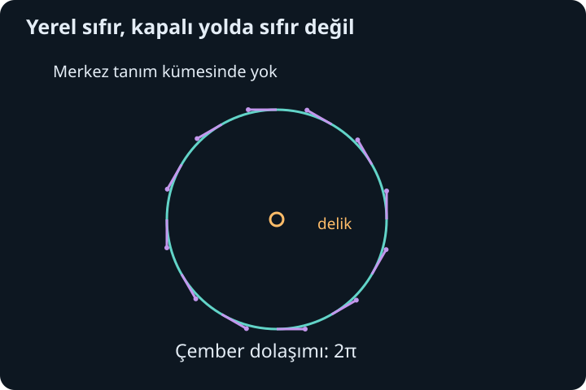
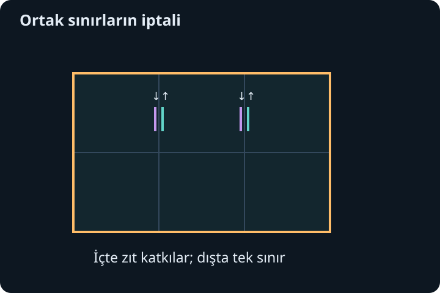

import ArticleVideo from '@/components/ArticleVideo.astro'
import kavram from './media/01-kavram.mp4?url'
import kavramPoster from './media/01-kavram.jpg?url'

Bir haritanın her noktasına sıcaklık gibi tek bir sayı yazarsak skaler alan elde ederiz. Her noktaya yönü ve büyüklüğü olan bir ok yerleştirirsek vektör alanı oluşur. Bu oklar bir akışın yönünü gösterebilir, ama vektör alanı tanımlamak için akışkan fiziği bilmek gerekmez. Matematiksel olarak her konuma bir vektör atamak yeterlidir.

[Önceki yazıda](/blog/cok-katli-integraller-ve-koordinatlar/) bölgeler üzerinde toplama yapmayı ve alan-hacim elemanlarını öğrendik. Şimdi bir alanın eğri boyunca ne kadar yönlü katkı verdiğini ve bir yüzeyden ne kadar geçtiğini ölçeceğiz. Çizgi integrali, akı, diverjans ve rotasyonel bu farklı soruların araçlarıdır. Green, Gauss ve Stokes teoremleri ise küçük bölgelerin iç sınırlarının birbirini götürmesini büyük bölgenin sınırına bağlar.

## 1. Alanın bileşenlerini okumak

Düzlemde $\mathbf F(x,y)=(P(x,y),Q(x,y))$ yazalım. $P$ yatay, $Q$ düşey bileşendir. $\mathbf F=(x,y)$ alanında oklar orijinden dışarıya yönelir ve uzaklıkla büyür. $\mathbf G=(-y,x)$ alanında oklar merkez çevresindeki çemberlere teğettir. Birincisi dışarı yayılma, ikincisi dolaşma fikrini görünür kılar.

Uzayda üçüncü bileşeni ekleriz: $\mathbf F=(P,Q,R)$. Buradaki $R$ bir bileşen fonksiyonudur; yarıçapla karışmaması için bağlama dikkat edeceğiz. Alanı değerlendirirken önce konumu bileşen fonksiyonlarında yerine koyarız. Örneğin $\mathbf F(x,y,z)=(xy,z,x)$ için $(2,1,3)$ noktasındaki vektör $(2,3,2)$'dir.

Ok çizimi yalnız seçilmiş noktalardaki alanı gösterir. Çok yoğun veya seyrek bir resim tek başına kesin integral hesabı değildir. Kesin sonuçlar, alanın formülü ve hangi eğri ya da yüzey üzerinde toplandığıyla belirlenir. Özellikle tekillik bulunan noktaların çizimde görünmemesi, onların hesapta önemsiz olduğu anlamına gelmez.

## 2. Eğriyi parametreyle izlemek

Bir eğriyi $\mathbf r(t)=(x(t),y(t),z(t))$, $a\leq t\leq b$ biçiminde yazalım. Türev $\mathbf r'(t)$ eğrinin teğet yönünü ve parametreye göre ilerleme hızını verir. Küçük yer değiştirme $d\mathbf r=\mathbf r'(t)dt$, küçük yay uzunluğu $ds=|\mathbf r'(t)|dt$ olur.

Bu iki eleman farklıdır. $d\mathbf r$ yönlüdür; $ds$ negatif olmayan uzunluktur. Bir skaler yoğunluğu eğri boyunca toplarsak $\int_C fds=\int_a^bf(\mathbf r(t))|\mathbf r'(t)|dt$ kullanırız. Eğriyi ters yönde yürümek bu toplamı değiştirmez. Bir vektör alanının teğetsel katkısını toplamak ise yönü korumayı gerektirir.

Düzgün eğri derken türevli ve teğet vektörü sıfır olmayan parçalarla çalışıyoruz. Köşeli yolları sonlu sayıda düzgün parçaya ayırabiliriz. Bir çemberi iki kez dolaşan parametreleme ile bir kez dolaşan parametreleme aynı yönlü toplamı vermek zorunda değildir; kaç kez gezildiği de verinin parçasıdır.

## 3. Vektör alanının çizgi integrali

Eğri boyunca küçük yer değiştirmeyle alanın skaler çarpımını toplarız:

$$
\int_C\mathbf F\cdot d\mathbf r
=\int_a^b\mathbf F(\mathbf r(t))\cdot\mathbf r'(t)dt.
$$

Bileşen yazımı $\int_C Pdx+Qdy+Rdz$'dir. Alanın eğriye dik bileşeni skaler çarpımda katkı vermez. Eğri yönünü ters çevirirsek $d\mathbf r$ değişir ve integralin işareti ters döner. Aynı yönü koruyan düzgün parametre değişiklikleri sonucu değiştirmez.

$\mathbf F=(y,x)$ ve $(0,0)$'dan $(1,1)$'e giden $\mathbf r(t)=(t,t)$ yolunu seçelim. $0\leq t\leq1$, $\mathbf r'=(1,1)$ ve alan $(t,t)$ olur. İntegrand $2t$, sonuç 1'dir. Şimdi önce yatay olarak $(1,0)$'a, sonra dikey olarak $(1,1)$'e gidelim. İlk parçada $y=0$, $dy=0$ olduğundan katkı sıfırdır. İkinci parçada $x=1$, $dx=0$ olduğundan $\int_0^1dy=1$ gelir.

İki yol aynı sonucu verdi. Bu her alan için doğru değildir; birazdan bu alanın özel bir potansiyel yapısı olduğunu göreceğiz. Tek bir çift yolun eşit çıkması genel yol bağımsızlığını kanıtlamaz, fakat hangi yapıyı arayacağımıza işaret eder.

## 4. Potansiyel ve yol bağımsızlığı

Bir skaler $\phi$ fonksiyonu için $\mathbf F=\nabla\phi$ ise alana konservatif, $\phi$'ye potansiyel fonksiyon deriz. Burada “potansiyel” yalnız matematiksel isimdir; fiziksel enerji anlamını daha sonra ayrıca kuracağız. Zincir kuralı:

$$
\nabla\phi(\mathbf r(t))\cdot\mathbf r'(t)
=\frac d{dt}\phi(\mathbf r(t))
$$

verir. Temel teoremle çizgi integrali $\phi(\mathbf r(b))-\phi(\mathbf r(a))$ olur. Böylece sonuç yalnız uçlara bağlıdır. Kapalı bir yolda başlangıç ve bitiş aynı olduğu için integral sıfırdır.

$\mathbf F=(y,x)$ için $\phi(x,y)=xy$ seçebiliriz; çünkü $\phi_x=y$, $\phi_y=x$. İki yol hesabının sonucu bu nedenle $1\cdot1-0\cdot0=1$ oldu. Potansiyel bulmayı adım adım da yapabiliriz: $\phi_x=y$ denkleminden $\phi=xy+h(y)$ yazılır. $x$'e göre türevde kaybolan şey yalnız sabit değil, $y$'nin herhangi bir fonksiyonudur. İkinci koşul $\phi_y=x+h'(y)=x$ olduğundan $h'=0$ ve $h$ sabittir.

Açık, yol bağlantılı bir bölgede bütün yollar için uçlara bağlılık varsa bir başlangıç noktası seçip potansiyeli çizgi integraliyle tanımlayabiliriz. Yol bağımsızlığı tanımı belirsizlikten kurtarır. Bu nedenle potansiyel varlığı ile yol bağımsızlığı uygun düzenlilik koşullarında aynı yapının iki anlatımıdır.

## 5. Küçük kapalı dolaşım ve rotasyonel

Düzlemde küçük bir dikdörtgeni saat yönünün tersine dolaşalım. Yatay kenarların katkı farkı yaklaşık $-P_y\Delta x\Delta y$, düşey kenarların farkı yaklaşık $Q_x\Delta x\Delta y$ olur. Toplamı alana bölersek $Q_x-P_y$ kalır. Bu sayı yerel dolaşım yoğunluğudur.

Uzayda bu bilgiyi üç dik düzlem için bir vektörde toplarız:

$$
\nabla\times\mathbf F=
(R_y-Q_z,\ P_z-R_x,\ Q_x-P_y).
$$

Bu vektöre **rotasyonel**, İngilizce adıyla curl denir. Yönü, yerel dolaşımın sağ el kuralına göre eksenini; ilgili birim normale skaler çarpımı, o düzlemdeki dolaşım yoğunluğunu verir. Her dönen gibi görünen ok resmi aynı rotasyoneli taşımaz; yerel türevler belirleyicidir.

$\mathbf F=(-y/2,x/2,0)$ için rotasyonel $(0,0,1)$'dir. $Q_x=1/2$, $P_y=-1/2$ olduğundan son bileşen 1 olur. Dairesel okların teğetsel büyüklüğü yarıçapla artar; küçük bölgelerdeki dolaşım alanla orantılıdır.

## 6. Sıfır rotasyonel ve bölgenin deliği

Sürekli ikinci türevli bir potansiyelin gradyanında rotasyonel sıfırdır; karışık türevler birbirini götürür. Ters sonuç için bölgenin yapısı önemlidir. Sürekli birinci türevli bir alan, açık ve basit bağlantılı bir bölgede sıfır rotasyonel taşıyorsa konservatiftir. Basit bağlantılı demek, her kapalı yolun bölgeden çıkmadan sürekli olarak bir noktaya küçültülebilmesi demektir.

Orijini çıkarılmış düzlemde:

$$
\mathbf F(x,y)=\left(-\frac y{x^2+y^2},\frac x{x^2+y^2}\right)
$$

alanının $Q_x-P_y$ değeri sıfırdır. Fakat birim çemberde $\mathbf r(t)=(\cos t,\sin t)$ için alan ve teğet aynı $(-\sin t,\cos t)$ vektörüdür. Skaler çarpımları 1 ve kapalı integral $\int_0^{2\pi}1dt=2\pi$ olur. Dolayısıyla bölgede tek değerli bir potansiyel yoktur.

Sorun merkezdeki eksik noktadır. Çemberi orijine çökertmeye çalışırken tanım kümesinden çıkarız. Yerel türev koşulu, bölgenin deliğini tek başına göremez. Bu örnek “curl sıfırsa her yerde potansiyel vardır” cümlesinin neden eksik olduğunu açıkça gösterir.

## 7. Green teoremi: iç dolaşım ile sınır

$D$ düzlemde parça parça düzgün sınırı olan sınırlı bir bölge olsun. $P,Q$ bölgeyi ve sınırını içeren açık bir çevrede sürekli birinci türevlere sahip olsun. Pozitif yön, dış sınırda saat yönünün tersidir. Delik varsa iç sınırlar saat yönünde dolaşılır. Green teoremi:

$$
\oint_{\partial D}Pdx+Qdy
=\iint_D(Q_x-P_y)dA
$$

der. $\partial D$ bölgenin sınırıdır; integral işaretindeki çember kapalı yol boyunca toplandığını gösterir.

Gerekçenin çekirdeği küçük dikdörtgen hesabıdır. Bölgeyi komşu parçalara ayırıp her parçanın sınırını pozitif yönde dolaşınca ortak kenarlar iki kez ve zıt yönde sayılır. İç katkılar birbirini götürür, yalnız dış sınır kalır. Küçük dolaşım yoğunluklarının toplamı da çift integrale yaklaşır. Düzgünlük koşulları bu limit geçişini güvenilir yapar.

$\mathbf F=(-y/2,x/2)$ için $Q_x-P_y=1$ olduğundan sınır dolaşımı bölgenin alanına eşittir. Yarıçapı $a$ olan çemberde doğrudan parametreleme de $\mathbf F\cdot\mathbf r'=a^2/2$ verir; $0$ ile $2\pi$ arasında integral $\pi a^2$ olur. Alan formülünü bu kez sınırdaki alan bilgisiyle elde ettik.

## 8. Yüzey normali ve akı

Bir yüzeyin küçük parçasının alanı $dS$, seçilen birim normali $\widehat{\mathbf n}$ olsun. Alanın bu yüzeyden yönlü geçişini:

$$
\iint_S\mathbf F\cdot\widehat{\mathbf n}\,dS
$$

ile ölçeriz; buna **akı** denir. Alan yüzeye teğetse katkı sıfır, normal yönündeyse pozitif, tersindeyse negatiftir. Normali ters seçmek bütün akının işaretini değiştirir. Kapalı yüzeylerde genellikle dışarı bakan normal seçilir.

Yüzey $\mathbf r(u,v)$ ile parametrelenmişse iki teğet $\mathbf r_u$ ve $\mathbf r_v$ küçük hücreyi gerer. Yönlü alan elemanı $(\mathbf r_u\times\mathbf r_v)dudv$ olur. Böylece akı $\iint\mathbf F(\mathbf r(u,v))\cdot(\mathbf r_u\times\mathbf r_v)dudv$ ile hesaplanır. Parametre sırası normal yönünü belirlediği için kontrol edilmelidir.

Basit örnekte $z=2$ düzlemindeki alanı 6 olan dikdörtgenden $\mathbf F=(0,0,3)$ geçsin. Yukarı normali $(0,0,1)$ seçersek integrand sabit 3 ve akı 18'dir. Aşağı normal seçilirse $-18$ olur. Alanın büyüklüğü aynı kaldığı halde yönlü ölçüm işaret değiştirir.

## 9. Diverjans: küçük hacimden net çıkış

$\mathbf F=(P,Q,R)$ için **diverjans**:

$$
\nabla\cdot\mathbf F=P_x+Q_y+R_z
$$

olarak tanımlanır. Küçük bir kutunun karşılıklı $x$ yüzlerinden çıkan akı farkı yaklaşık $P_x\Delta x\Delta y\Delta z$'dir. Diğer iki eksen benzer katkı verir. Toplam akıyı hacme bölünce diverjans kalır. Pozitif değer yerel net dışarı çıkışı, negatif değer net içeri girişi gösterir.

$\mathbf F=(x,y,z)$ için diverjans 3'tür. $\mathbf G=(-y,x,0)$ için diverjans sıfırdır; alan dolaşır ama küçük hacimde net kaynak oluşturmaz. Diverjans ile rotasyonel farklı sorulara cevap verir. Birinin sıfır olması diğerinin de sıfır olmasını gerektirmez.

## 10. Gauss teoremi: hacim ile kapalı yüzey

$E$ sınırlı bir katı bölge, sınırı parça parça düzgün kapalı yüzey olsun. Alan, bölge ve sınırının açık bir çevresinde sürekli birinci türevli olsun. Dış normal seçilince diverjans, yani Gauss teoremi:

$$
\iint_{\partial E}\mathbf F\cdot\widehat{\mathbf n}\,dS
=\iiint_E\nabla\cdot\mathbf F\,dV
$$

verir. Küçük kutuların ortak yüzlerinde dış normaller zıttır; iç akılar iptal olur. Geriye yalnız bütün cismin dış yüzeyi kalır. Green'deki kenar iptali burada yüz iptaline dönüşür.

$\mathbf F=(x,y,z)$ ve yarıçapı $a$ olan küre için hacim hesabı $3\cdot4\pi a^3/3=4\pi a^3$ verir. Yüzeyde alan $a\widehat{\mathbf n}$ olduğu için doğrudan akı da $a\cdot4\pi a^2=4\pi a^3$'tür. İki hesap aynı sonucu farklı boyuttaki integrallerle verir. Alan kürenin içinde tekil olsaydı teoremin koşulunu ayrıca incelememiz gerekirdi.

## 11. Stokes: yüzeydeki dönme ile kenar dolaşımı

$S$ yönlendirilebilir, parça parça düzgün bir yüzey; $\partial S$ onun kapalı sınır eğrisi olsun. Alan yüzeyin bir açık çevresinde sürekli birinci türevli olsun. Seçilen normal ile sınırın dolaşma yönü sağ el kuralına uymalıdır. Stokes teoremi:

$$
\oint_{\partial S}\mathbf F\cdot d\mathbf r
=\iint_S(\nabla\times\mathbf F)\cdot\widehat{\mathbf n}\,dS
$$

der. Normal yönünden yüzeye bakıldığında pozitif sınır yönü saat yönünün tersidir. Yüzeyi küçük parçalara ayırınca iç kenarlardaki dolaşımlar yine iptal olur. Green teoremi, düz bir yüzeyde Stokes'un özel görünümüdür.

$\mathbf F=(-y/2,x/2,0)$ alanında rotasyonel $(0,0,1)$'dir. $xy$ düzlemindeki yarıçapı $a$ olan çemberi yukarı yönlü diskle doldurursak yüzey integrali disk alanı $\pi a^2$ olur. Aynı çemberi üst yarımküreyle doldurmak sonucu değiştirmez; bu kez $(0,0,1)\cdot\widehat{\mathbf n}\,dS$ yüzey parçasının yatay izdüşüm alanıdır ve toplam yine disk alanını verir.

Bu, her yüzey integralinin yalnız sınıra bağlı olduğu anlamına gelmez. Burada integrand özel olarak bir alanın rotasyonelidir ve yönler uyumludur. Teoremin nesnesini değiştirdiğimizde aynı sonucu beklemeyiz.

<ArticleVideo src={kavram} poster={kavramPoster} title="Düzlemde dışarı akı" caption="F=(x,y) alanının çember sınırındaki okları dış normalle aynı yönü gösterir. Düzlemsel diverjans 2 olduğu için toplam dışarı akı, diskin alanının iki katıdır." />

## 12. Türev işlemleri arasındaki iki kimlik

Sürekli ikinci türevler altında $\nabla\times(\nabla\phi)=\mathbf0$ ve $\nabla\cdot(\nabla\times\mathbf F)=0$ olur. Her bileşende aynı karışık türev karşı işaretlerle iki kez yer alır. Bu eşitlikler, potansiyel alanların yerel dolaşımının sıfır olmasıyla ve bir rotasyonelin net kaynak üretmemesiyle uyumludur.

İleride alanların değişimini incelerken şu kimlik de yararlı olacak:

$$
\nabla\times(\nabla\times\mathbf F)
=\nabla(\nabla\cdot\mathbf F)-\nabla^2\mathbf F.
$$

Burada $\nabla^2f=f_{xx}+f_{yy}+f_{zz}$ Laplasyen adını taşır; vektöre uygulandığında her bileşene ayrı uygulanır. Kimliğin ilk bileşenini açarsak $\partial_y(Q_x-P_y)-\partial_z(P_z-R_x)$ elde ederiz. Karışık türevlerin yerini değiştirip düzenleyince $\partial_x(P_x+Q_y+R_z)-(P_{xx}+P_{yy}+P_{zz})$ olur. Diğer bileşenler aynı döngüyle çıkar.

Bu son formüller yalnız simgesel benzerlikten doğmaz; belirtilen türev düzenliliğine ve bileşen hesabına dayanır. Alanlarla çalışırken hangi boyutta topladığımızı, hangi yönü seçtiğimizi ve fonksiyonun nerede düzgün olduğunu açık tutarsak, çok sayıda görünen kural tek bir düşüncede birleşir: yerel değişimlerin toplamı, uygun koşullarda sınırdaki ölçüme dönüşür.

## Kaynaklar

- [OpenStax, Calculus Volume 3: Line Integrals](https://openstax.org/books/calculus-volume-3/pages/6-2-line-integrals)
- [OpenStax, Calculus Volume 3: Green’s Theorem](https://openstax.org/books/calculus-volume-3/pages/6-4-greens-theorem)
- [OpenStax, Calculus Volume 3: Stokes’ Theorem](https://openstax.org/books/calculus-volume-3/pages/6-7-stokes-theorem)
- [OpenStax, Calculus Volume 3: The Divergence Theorem](https://openstax.org/books/calculus-volume-3/pages/6-8-the-divergence-theorem)
