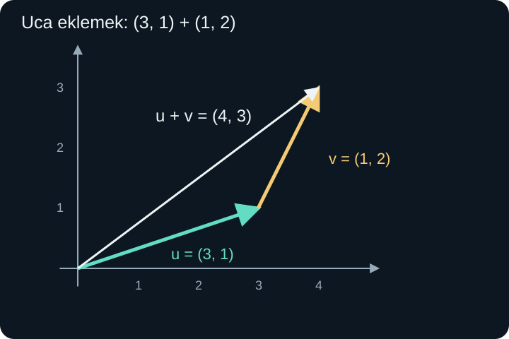
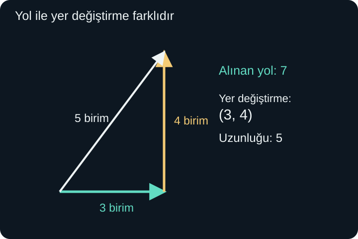

import ArticleVideo from '@/components/ArticleVideo.astro'
import kavram from './media/01-kavram.mp4?url'
import kavramPoster from './media/01-kavram.jpg?url'

Bir arkadaşımıza “5 metre ilerledim” dediğimizde ne kadar hareket ettiğimizi söylemiş oluruz. Fakat nerede bulunduğumuzu anlatmak için bu bilgi yeterli değildir. Kuzeye 5 metre ilerlemek ile doğuya 5 metre ilerlemek farklı son noktalara götürür. Bazı büyüklükleri yalnızca bir sayı ve birimle, bazılarını ise yön bilgisiyle birlikte belirtmemiz gerekir.

Bu ayrım bizi **skaler** ve **vektör** kavramlarına getirir. Sıcaklık, süre veya kütle gibi yön gerektirmeyen büyüklükleri bu bağlamda skalerlerle ifade ederiz. Yer değiştirme ve hız gibi büyüklükler ise yön de taşır. Bu yazıda vektörleri önce düzlemdeki hareket okları olarak kuracak, sonra onları koordinatlarla hesaplayacağız.

[Önceki yazıda](/blog/ucgen-cozumu-ve-ters-trigonometri/) kenarlar ile açılar arasında ilişki kurduk. Burada koordinat düzlemi, işaretli sayılar, Pisagor ve temel trigonometrik oranlar yeterlidir. Skaler çarpım, matris veya daha soyut vektör uzayı bilgisi gerekmeyecek.

## 1. Bir Okun Hangi Bilgisini Taşıyoruz?

Düzlemde $A$ noktasından $B$ noktasına uzanan oku $\overrightarrow{AB}$ biçiminde gösteririz. Okun kuyruğu başlangıcı, ucu varışı gösterir. Uzunluğu hareketin net büyüklüğünü, doğrultusu ve ok ucu ise yönünü belirtir.

İki ok aynı uzunluğa ve aynı yöne sahipse, düzlemin farklı yerlerine çizilmiş olsalar da aynı **serbest vektörü** temsil eder. “Serbest” sözü, başlangıç konumunun vektörün değişmez bir parçası olmadığını vurgular. Oku döndürmeden ve boyunu değiştirmeden taşıyabiliriz. Sağa 3, yukarı 1 birimlik hareket, hangi noktadan başlarsa başlasın aynı yer değiştirmedir.

Buna karşılık “şu cisme şu noktada uygulanan kuvvet” gibi fiziksel bir problemde uygulama noktasının ayrıca önemi olabilir. Serbest vektör modeli yön ile büyüklüğü temsil eder; fiziksel sorunun gerektirdiği bütün bilgiyi tek başına içerdiğini varsaymayız. Şimdilik yer değiştirme üzerinde çalışmamız, hangi bilgiyi taşıdığımızı açık tutar.

Vektörleri $\mathbf u$, $\mathbf v$ gibi kalın harflerle yazacağız. Kalın yazım onların tek bir sıradan sayı olmadığını hatırlatır. Skalerler için $t$, $k$ gibi normal harfler kullanacağız. Her sembolün görevini bağlamında belirlemek, ileride farklı işlemleri karıştırmamamızı sağlar.

## 2. Koordinatlar Bir Hareketi Nasıl Anlatır?

$A=(2,-1)$ ve $B=(5,3)$ noktalarını seçelim. $A$'dan $B$'ye gitmek için yatay koordinat $5-2=3$, düşey koordinat $3-(-1)=4$ değişmelidir. Dolayısıyla:

$$
\overrightarrow{AB}=(3,4).
$$

İlk sayı yatay, ikinci sayı düşey **bileşendir**. Bileşenler işaretli miktarlardır: pozitif yatay değer sağa, negatif yatay değer sola; pozitif düşey değer yukarı, negatif düşey değer aşağı yönelimi gösterir. Eksenlerin yönünü baştan farklı seçersek işaretlerin fiziksel anlamını da buna göre belirtiriz.

Genel olarak $A=(a_1,a_2)$, $B=(b_1,b_2)$ için:

$$
\overrightarrow{AB}=(b_1-a_1,\ b_2-a_2).
$$

Alt indis 1 ilk bileşeni, 2 ikinci bileşeni adlandırır. Bu indisler üs değildir. Örneğin $a_2$, $a$'nın karesi anlamına gelmez; başlangıç noktasının ikinci koordinatıdır.

Aynı $(3,4)$ vektörünü başlangıç noktasından $(3,4)$ noktasına uzanan okla da çizebiliriz. Böylece vektörü standart bir yerde görmüş oluruz. Fakat $(3,4)$ noktasının bir adres, $(3,4)$ vektörünün bir hareket bilgisi olarak kullanıldığını ayırt etmeliyiz. Aynı sayı çifti farklı görevlerde bulunabilir.

Bir noktaya bir yer değiştirme eklemek yeni bir nokta verir. Örneğin $A=(2,-1)$ adresine $(3,4)$ hareketini uygularsak $(2+3,-1+4)=(5,3)$ adresine ulaşırız. İki noktanın farkı ise aralarındaki yer değiştirmeyi verir. Bu yorum, koordinatlarla işlem yaparken hangi nesneyi hesapladığımızı açıklar.

## 3. Toplama: Bir Hareketin Ardından Diğeri

Önce $\mathbf u=(3,1)$, sonra $\mathbf v=(1,2)$ kadar yer değiştirelim. Toplam yatay değişim $3+1=4$, düşey değişim $1+2=3$ olur:

$$
\mathbf u+\mathbf v=(4,3).
$$

Geometrik çizimde ikinci okun kuyruğunu birincinin ucuna yerleştiririz. Başlangıçtan son noktaya uzanan tek ok toplamdır. Bu, **uç uca ekleme** yöntemidir. İkinci oku taşırken yönünü ve uzunluğunu koruruz; onu birincinin ucuna bakacak biçimde döndürmeyiz.

Bileşenlerle genel kural:

$$
(u_1,u_2)+(v_1,v_2)=(u_1+v_1,u_2+v_2).
$$

Yatay miktarları yataylarla, düşey miktarları düşeylerle toplarız. Yatay ile düşey bileşeni toplayıp tek bir sayı bulmak, bu iki farklı yön bilgisini kaybettirir.

<ArticleVideo src={kavram} poster={kavramPoster} title="Vektörlerin uç uca toplanması" caption="(3, 1) vektörünün ucuna (1, 2) eklenir. Başlangıçtan son noktaya uzanan toplam vektör (4, 3) olur." />

Toplama sırası sonucu değiştirmez. Önce $(1,2)$, sonra $(3,1)$ gidersek yine $(4,3)$ değişimine ulaşırız. Bileşen düzeyinde bu, gerçek sayıların toplamasındaki değişme özelliğidir. İki oku aynı başlangıca koyduğumuzda oluşturdukları paralelkenarın karşı köşesi toplamı gösterir; iki yürüyüş sırası paralelkenarın farklı kenarlarından aynı köşeye gider.

Üç veya daha çok vektör için de her bileşendeki bütün değişimleri toplarız. Parantezin yeri sonucu değiştirmez: $(\mathbf u+\mathbf v)+\mathbf w=\mathbf u+(\mathbf v+\mathbf w)$. Fakat bu sonuç gidilen yolun veya geçen zamanın aynı olduğunu söylemez; yalnızca net yer değiştirmenin aynı olduğunu söyler.

## 4. Sıfır Vektörü ve Ters Yöndeki Vektör

$\mathbf0=(0,0)$ vektörü hiçbir net değişim yapmaz. Herhangi bir vektöre eklenince o vektör kalır. Sıfır vektörünün uzunluğu sıfırdır; bu yüzden ona belirli bir geometrik yön atamayız.

$\mathbf u=(3,1)$ için $-\mathbf u=(-3,-1)$ vektörü aynı uzunlukta, ters yöndedir. İkisini topladığımızda $(0,0)$ elde edilir. Önce sağa 3, yukarı 1 gittikten sonra sola 3, aşağı 1 gitmek başlangıca döndürür.

Eksi işareti yalnızca ilk bileşene uygulanmaz. $-(3,1)=(-3,-1)$ olur; $(3,-1)$ ise yatay bileşeni koruyup düşey bileşeni değiştiren başka bir vektördür. İşlem hangi nesnenin önünde yazılmışsa tamamına uygulanmalıdır.

Bir vektörün bileşenlerinden birinin sıfır olması, vektörün sıfır olması demek değildir. $(0,5)$ düşey yönde 5 birimlik hareketi gösterir. Sıfır vektöründe bütün bileşenler sıfırdır.

## 5. Çıkarma: Bir Değişimi Geri Almak

Vektör çıkarmayı ters vektörü ekleyerek tanımlarız:

$$
\mathbf u-\mathbf v=\mathbf u+(-\mathbf v).
$$

$\mathbf u=(5,2)$ ve $\mathbf v=(1,4)$ için sonuç $(5-1,2-4)=(4,-2)$ olur. İki oku aynı başlangıçtan çizdiğimizde $\mathbf u-\mathbf v$, **$\mathbf v$'nin ucundan $\mathbf u$'nun ucuna** giden oktur.

Yönü kontrol etmek için $\mathbf v+(\mathbf u-\mathbf v)=\mathbf u$ eşitliğini okuyabiliriz. Önce $\mathbf v$'nin ucuna gitmişsek, toplamda $\mathbf u$'nun ucuna ulaşmak için fark vektörünü ekleriz. Çıkarmanın sırası değişirse yön tersine döner: $\mathbf v-\mathbf u=-(\mathbf u-\mathbf v)$.

Bu düşünce iki hareketli nesneyi karşılaştırırken yararlıdır. Birinin konum vektörü $(7,5)$, diğerinin $(2,3)$ metre olsun. İkinciden birinciye yer değiştirme $(5,2)$ metredir. Ters yöndeki soru $(-5,-2)$ verir. Aralarındaki uzaklık aynı olsa da yönlü farklar farklıdır.

## 6. Bir Sayıyla Çarpmak

Bir vektörü skalerle çarptığımızda her bileşeni aynı sayıyla çarparız:

$$
k(u_1,u_2)=(ku_1,ku_2).
$$

$\mathbf u=(3,4)$ için $2\mathbf u=(6,8)$, $\tfrac12\mathbf u=(3/2,2)$, $-2\mathbf u=(-6,-8)$ olur. Pozitif çarpan yönü korur; negatif çarpan yönü tersine çevirir. Uzunluk, çarpanın mutlak değeriyle çarpılır. Sıfırla çarpmak her vektörü sıfır vektörüne götürür.

Örneğin $-1/2$ ile çarpma “eksi uzunluk” oluşturmaz. Uzunluk yarıya iner ve yön tersine döner. Uzunluğun negatif olmaması, yönün işaretlerle ayrıca taşınmasının nedenlerinden biridir.

Skaler çarpma toplama üzerine dağılır. $2[(1,3)+(4,-1)]$ hesabında önce toplamı alırsak $2(5,2)=(10,4)$ buluruz. Ayrı ayrı çarpıp toplarsak $(2,6)+(8,-2)=(10,4)$ olur. Bu ilişki bileşenlerdeki sıradan dağılma özelliğinden gelir.

Buradaki işlem bir **sayı ile vektörün çarpımıdır**. İki vektörü çarpmaya yönelik başka işlemler daha sonra tanımlanacak. “Vektör çarpımı” sözünü tek bir işlem varmış gibi kullanmak, farklı sonuç türlerini karıştırabilir.

## 7. Uzunluk: Vektörün Normu

$\mathbf v=(3,4)$ vektörünü başlangıçtan çizdiğimizde dik kenarları 3 ve 4 olan bir üçgen oluşur. Pisagor'a göre uzunluğu 5'tir. Bir vektörün uzunluğuna bu Öklid geometrisi bağlamında **norm** der ve $\|\mathbf v\|$ ile gösteririz.

$$
\|\mathbf v\|=\sqrt{v_1^2+v_2^2}.
$$

Çift dik çizgi vektörün normunu, tek dik çizgi bir gerçek sayının mutlak değerini belirtmek için kullanılır. İkisinin de sonucu sıfır veya pozitif bir sayıdır. Fakat biri iki ya da daha çok bileşenli nesnenin uzunluğunu ölçer.

$\mathbf w=(-5,12)$ için $\|\mathbf w\|=\sqrt{25+144}=13$ olur. Negatif yatay bileşen, uzunluğun negatif olmasına yol açmaz; kare alındığında işaretin etkisi ortadan kalkar. $\|\mathbf v\|=0$ ise karelerin toplamı sıfır olmalıdır. Her kare sıfır veya pozitif olduğundan bütün bileşenler sıfırdır.

Skaler çarpma ile norm arasındaki ilişkiyi de hesaplayabiliriz:

$$
\|k\mathbf v\|=\sqrt{k^2(v_1^2+v_2^2)}
=|k|\,\|\mathbf v\|.
$$

Burada $\sqrt{k^2}=|k|$ kullanıldı. Mutlak değer yazmadan $k\|\mathbf v\|$ deseydik negatif $k$ için negatif uzunluk elde ederdik.

### Toplamın uzunluğu, uzunlukların toplamı değildir

Doğuya 3 ve kuzeye 4 birimlik vektörlerin toplamı $(3,4)$'tür ve uzunluğu 5'tir. Tek tek uzunlukların toplamı ise 7'dir. Genel olarak vektör toplamını bulmakla sayısal uzunlukları toplamak aynı işlem değildir.

Üçgen eşitsizliğinin vektörel yazımı $\|\mathbf u+\mathbf v\|\le\|\mathbf u\|+\|\mathbf v\|$ olur. Uç uca çizilen iki okla oluşan üçgende doğrudan kenar, dolanılan iki kenarın toplamından uzun olamaz. İki sıfırdan farklı vektör aynı yönde olduğunda eşitlik olur. Zıt yönde olduklarında uzunluklar birbirini kısmen veya tamamen götürebilir.

## 8. Yalnızca Yönü Taşımak: Birim Vektör

Normu 1 olan vektöre **birim vektör** denir. Sıfırdan farklı bir vektörün yönündeki birim vektörü bulmak için vektörü kendi uzunluğuna böleriz:

$$
\widehat{\mathbf v}=\frac{\mathbf v}{\|\mathbf v\|}.
$$

Şapka işareti burada aynı yöndeki birim vektörü gösterir. $\mathbf v=(3,4)$ için $\widehat{\mathbf v}=(3/5,4/5)$ olur. Normu $\sqrt{9/25+16/25}=1$'dir. Sıfır vektörü için bu işlem yapılamaz; normu sıfırdır ve yönü belirlenmemiştir.

Vektörü yeniden kurmak için $\mathbf v=\|\mathbf v\|\widehat{\mathbf v}$ yazarız. Böylece büyüklük ve yön iki ayrı parçaya ayrılmış olur. Örneğin yönü $(3/5,4/5)$ olan 10 birimlik vektör $10(3/5,4/5)=(6,8)$'dir.

Yatay eksenle $\theta$ açısı yapan birim vektör $(\cos\theta,\sin\theta)$ biçimindedir. Uzunluğu $r>0$ olan vektör ise:

$$
\mathbf v=(r\cos\theta,r\sin\theta)
$$

olur. Bu, birim çemberde öğrendiğimiz koordinatların uzunlukla ölçeklenmesidir. Örneğin 6 birim uzunluk ve 120 derece yön için $\mathbf v=(-3,3\sqrt3)$ buluruz. İkinci bölgede yatay bileşenin negatif, düşey bileşenin pozitif olması beklenir.

## 9. Üç Boyutta Bir Bileşen Daha

Bir odada konum belirlerken sağ-sol ve ileri-geri bilgisine yükseklik eklenir. Dik koordinat eksenleriyle üç boyutlu bir vektörü $(v_1,v_2,v_3)$ biçiminde yazarız. Bütün böyle gerçek sayı üçlülerinin kümesine $\mathbb R^3$ denir. İki bileşenli düzlem için $\mathbb R^2$ kullanılır.

Toplama ve sayıyla çarpma değişmez; üçüncü bileşene de aynı işlemi uygularız. Örneğin:

$$
(2,-1,3)+(-4,5,1)=(-2,4,4).
$$

Normu kurmak için önce yatay iki bileşenin oluşturduğu dikdörtgenin köşegenini buluruz: karesi $v_1^2+v_2^2$ olur. Bu köşegen ile üçüncü eksen birbirine diktir. Pisagor'u ikinci kez uygulayınca:

$$
\|\mathbf v\|=\sqrt{v_1^2+v_2^2+v_3^2}.
$$

$(2,-3,6)$ vektörünün normu $\sqrt{4+9+36}=7$'dir. Aynı yöndeki birim vektör $(2/7,-3/7,6/7)$ olur. Bir çizimde üçüncü eksen eğik gösterilse bile, kullanılan matematiksel koordinat sisteminde eksenler diktir. Ekranın iki boyutlu olması gerçek açıları çizimde bozabilir.

Birim eksen vektörlerini $\mathbf e_1=(1,0,0)$, $\mathbf e_2=(0,1,0)$ ve $\mathbf e_3=(0,0,1)$ diye adlandırabiliriz. Böylece $(2,-3,6)=2\mathbf e_1-3\mathbf e_2+6\mathbf e_3$ yazılır. Her bileşen, ilgili eksen yönünden kaç birim kullandığımızı söyler.

## 10. Sabit Hareket ve Koordinat Seçimi

Bir cismin başlangıç konumu $\mathbf r_0=(1,2)$ metre, sabit hız vektörü $\mathbf v=(3,-1)$ metre/saniye olsun. Başlangıçtan $t$ saniye sonra:

$$
\mathbf r(t)=\mathbf r_0+t\mathbf v
$$

yazarız. $t=4$ için yer değiştirme $(12,-4)$ metre, yeni konum $(13,-2)$ metredir. Hızın normu $\sqrt{10}$ metre/saniyedir; dört saniyede alınan yol $4\sqrt{10}$ metredir. Bu son eşitlik hareket boyunca hızın sabit kaldığı, yön değişmediği modelimize dayanır.

Bir kişi önce doğuya 5 metre, sonra batıya 5 metre giderse toplam yer değiştirmesi sıfırdır, ama 10 metre yol almıştır. Sadece son konumu başlangıçtan çıkarmak, arada nasıl bir rota izlendiğini açıklamaz. Konum, yer değiştirme ve yol uzunluğu bu nedenle ayrı kavramlardır.

Koordinat başlangıcını taşımak da yer değiştirmeyi değiştirmez. $A$ ve $B$ konumlarından aynı $\mathbf c$ vektörünü çıkarırsak yeni fark $(B-\mathbf c)-(A-\mathbf c)=B-A$ olur. Adresler değişti, aralarındaki hareket aynı kaldı.

Eksenleri döndürürsek aynı geometrik vektörün bileşenleri değişebilir; fakat dik eksenler ve aynı birim ölçeği kullanıldığında uzunluğu değişmez. Sağa doğru çizdiğimiz bir ok başka bir gözlemcinin çiziminde eğik durabilir. Vektörün kendisi ile onu tarif etmek için seçilen sayı listesini ayırmaya başlamamızın nedeni budur.

### Bileşenlerden yönü geri bulurken

Bir vektörün bileşenlerini bildiğimizde uzunluğunu normla bulduk. Açıyı da tanjanttan arayabiliriz, fakat bölgeyi ayrıca okumalıyız. Örneğin $\mathbf v=(-3,3\sqrt3)$ için düşey bileşenin yataya oranı $-\sqrt3$ olur. Hesap makinesindeki $\arctan(-\sqrt3)$ çıktısı $-60^\circ$'dir. Oysa vektör ikinci bölgededir; doğru standart yön açısı $120^\circ$ olmalıdır.

Arktanjantın tek başına yeterli olmamasının nedeni, tanjantın yarım tur sonra aynı değeri vermesidir. Oran aynıyken hem yatay hem düşey işareti tersine dönebilir. Bileşenlerin işaretlerini kullanarak hangi adayın uygun olduğunu seçeriz. Yatay bileşen sıfırsa bölme yapmayız: pozitif düşey bileşen 90 dereceyi, negatif düşey bileşen 270 dereceyi gösterir. İkisi de sıfırsa yön açısı yoktur.

Ölçek de çizimin doğru okunmasını etkiler. Yatay eksende bir kare 1 metre, düşey eksende bir kare 2 metre gösteriyorsa, ekranda eşit görünen iki parça aynı fiziksel uzunlukta değildir. Norm hesabına piksel veya kare sayılarını değil, aynı birime çevrilmiş gerçek bileşenleri koyarız. Şekil bizim hesap yapmamıza yardım eder; ölçekleri belirtmeden yalnızca görünüşten uzunluk çıkarmak güvenilir değildir.

Yönlü miktarları toplamak ve uzunluklarını ölçmek için artık bir dilimiz var. Bir sonraki yazıda iki vektörün birbirine ne kadar aynı yönde baktığını tek bir sayıyla ölçen skaler çarpımı kuracağız. Bu işlem, açı hesabını ve bir yöndeki izdüşümü aynı bağıntıda birleştirecek.

## Kaynakça

Tanımlar ve işlem koşulları için aşağıdaki açık kitap sayfaları 8 Ekim 2026 tarihinde doğrudan kontrol edilmiştir. Anlatım, hesap örnekleri ve şekiller özgün hazırlanmıştır.

- [OpenStax, Precalculus 2e — Vectors](https://openstax.org/books/precalculus-2e/pages/8-8-vectors): Bileşenler, norm, yön açısı ve birim vektörün koşulları.
- [Georgia Tech, Interactive Linear Algebra — Vectors](https://textbooks.math.gatech.edu/ila/vectors.html): Vektörlerin geometrik ve koordinat gösterimleri, toplama ve skalerle çarpma.
